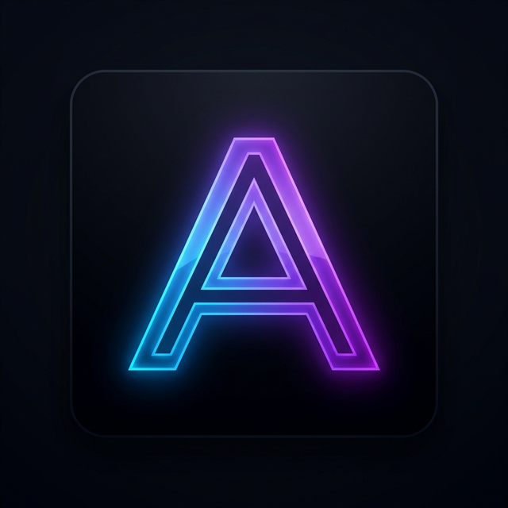

<div align="center">
  
  
  # 🌌 Aura OS: Your Portfolio, Reimagined as an Operating System
  
  *A fully interactive, desktop-grade simulated operating system built directly for the web and native Android.*

  [](https://nextjs.org/)
  [](https://reactjs.org/)
  [](https://tailwindcss.com/)
  [](https://www.framer.com/motion/)
  [](https://capacitorjs.com/)

  [**Launch Live Web App**](https://aura-os-theta.vercel.app/) | [**Download Android APK / iOS Instructions**](https://ashwinjauhary.github.io/Aura-OS-Sources/)
</div>

---

## 📖 About The Project

Why send a boring PDF resume when you can let people explore your skills, projects, and experiences through a fully interactive simulated desktop environment? 

**Aura OS** is a cutting-edge interactive portfolio designed to feel exactly like a modern operating system. Built with React and Next.js, it features fluid window management, a dynamic control center, a functional dock, and stunning 60fps animations.

Whether viewed in a web browser, installed as an iOS PWA, or launched via the native Android `.apk`, Aura OS provides a seamless, immersive aesthetic experience.

---

## ✨ Key Features

- 🖥️ **Desktop-Grade Feel**: Complete with a dock, control center, dynamic wallpapers, and native system sounds.
- 🗂️ **Fluid Window Management**: Open multiple apps concurrently. Drag, minimize, maximize, and arrange your workspace. Multi-tasking built for the browser.
- 🎨 **Dynamic Control Center**: Toggle Dark Mode, alter system brightness, change aesthetic wallpapers, and silence notifications via a frosted glass control center that persists your preferences.
- ⚡ **Buttery Smooth Performance**: Powered by Framer Motion, ensuring 60fps animations and immediate interaction responses.
- 📱 **Cross-Platform Access**: Usable on Desktop Web, Native Android, and iOS Safari.

---

## 🏗️ Architecture & OTA Updates

Aura OS utilizes a unique deployment architecture that ensures users **never have to manually update their Android App**.

### 1. The Core Web App (Next.js)
The brain of the OS is built using **Next.js** and hosted dynamically on **Vercel** (`aura-os-theta.vercel.app`). All logic, styling, and data live here.

### 2. The Android Wrapper (Ionic Capacitor)
The Android `.apk` is built using **Capacitor**. Instead of bundling the web code locally inside the app, the Capacitor `capacitor.config.ts` is configured to point directly to the live Vercel URL (`server.url`). 

**How OTA (Over-The-Air) Updates Work:**
Because the Android app is essentially a native wrapper fetching the live URL:
1. When you push new code to GitHub, Vercel deploys the changes to the website immediately.
2. The next time a user opens the `AuraOS` app on their Android phone, **the app fetches the newly updated website instantly**.
3. **Result:** Seamless OTA updates. The user never has to download a new `.apk` to see your latest projects or fixes!

### 3. The iOS Progressive Web App (PWA)
iOS users can install the application natively by visiting the live URL in Safari and tapping "Add to Home Screen". It functions as a PWA, hiding the Safari URL bar and granting a native app-like experience.

### 4. Standalone Landing Page
A separate, pure HTML/CSS/JS repository acts as the central hub to download the `.apk` or view iOS instructions, beautifully styled with AI-generated assets to match the OS aesthetic.

---

## 🛠️ Built With

*   **Framework**: [Next.js](https://nextjs.org/)
*   **Library**: [React](https://reactjs.org/)
*   **Styling**: [Tailwind CSS](https://tailwindcss.com/)
*   **Animations**: [Framer Motion](https://www.framer.com/motion/)
*   **Icons**: [Lucide React](https://lucide.dev/)
*   **Native Wrapper**: [Capacitor](https://capacitorjs.com/)

---

## 🚀 Getting Started Locally

To run the Next.js Web App locally on your machine:

1. **Clone the repository**
   ```bash
   git clone https://github.com/Ashwinjauhary/Aura-OS.git
   cd portfolio-os
   ```

2. **Install local NPM packages**
   ```bash
   npm install
   ```

3. **Run the development server**
   ```bash
   npm run dev
   ```

4. Open `http://localhost:3000` in your browser to see the OS.

---

## 👨‍💻 Created By

**Ashwin Jauhary**
- Building next-generation digital experiences.
- *Designed and developed with a focus on immersive UI/UX.*
